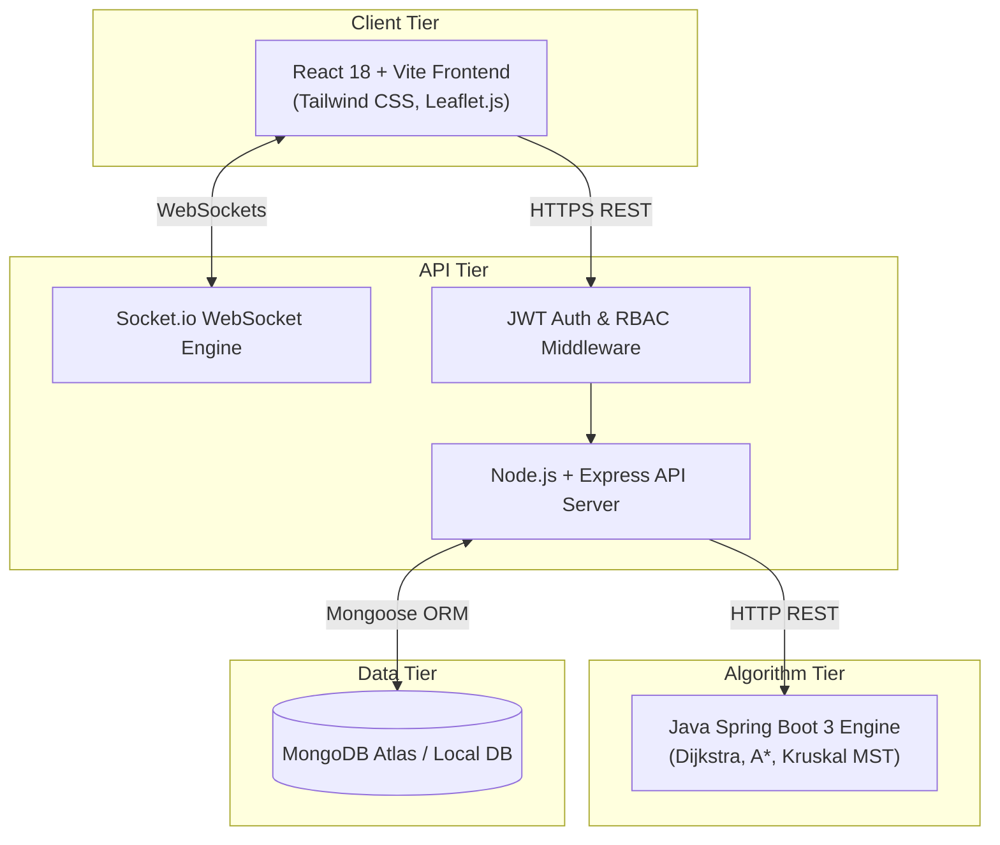
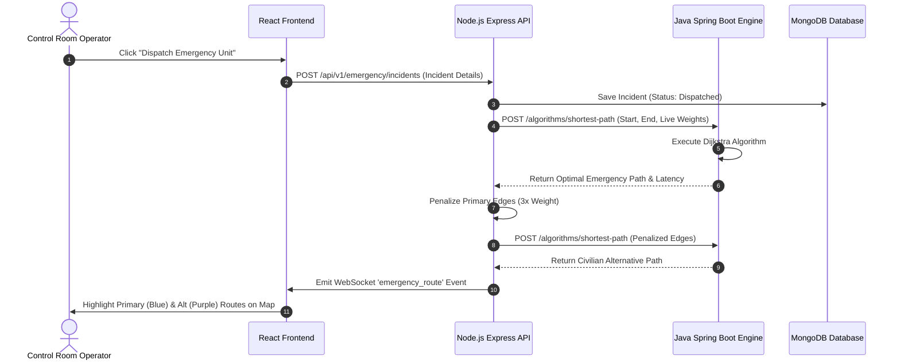
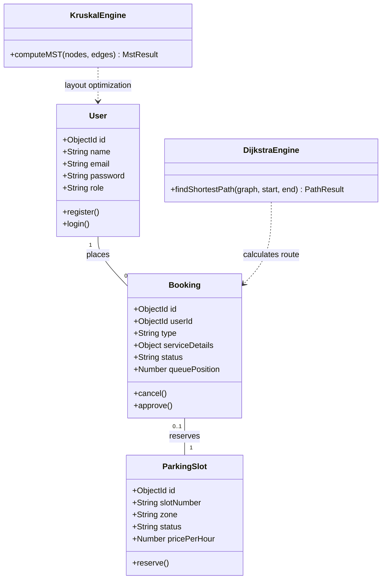
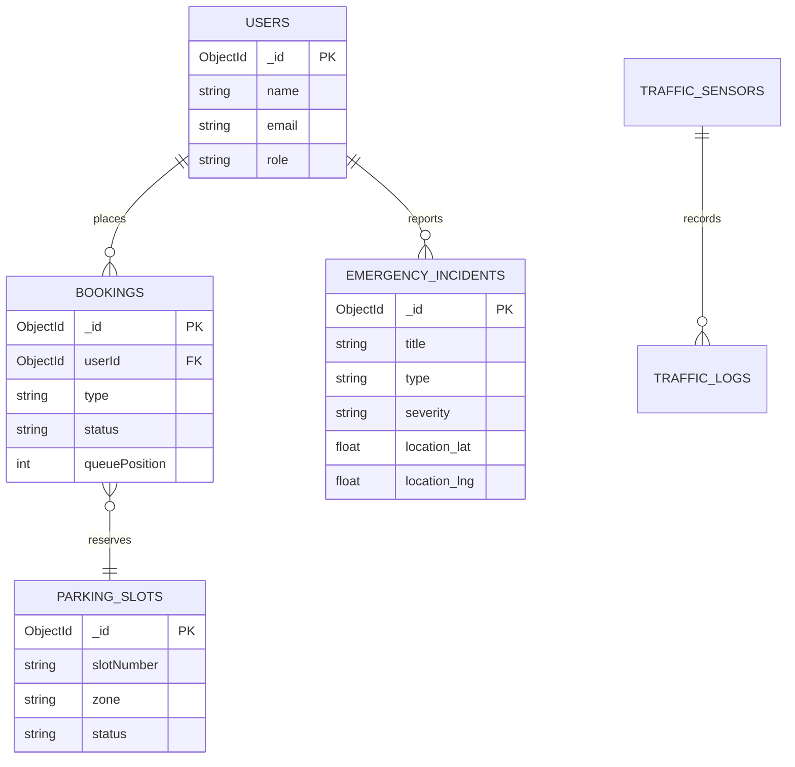
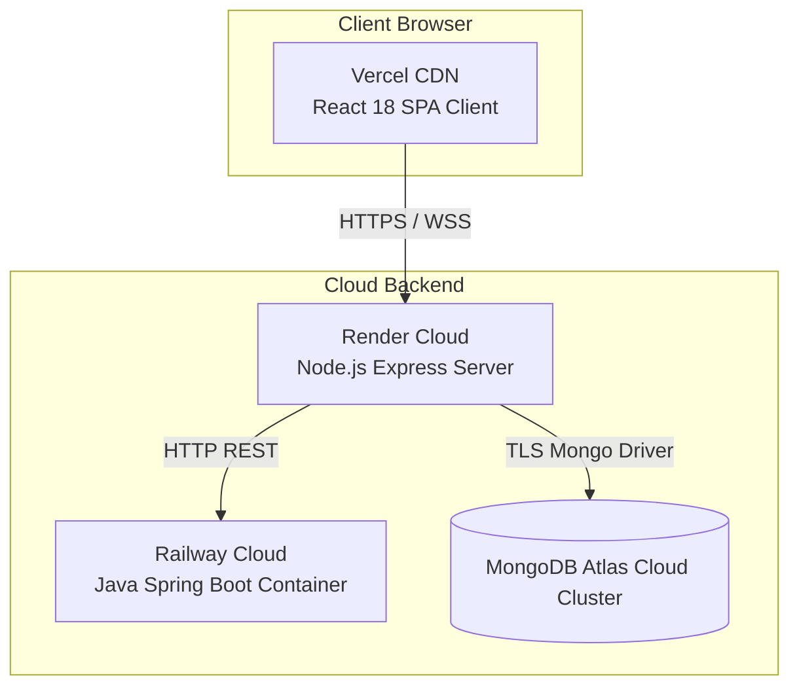
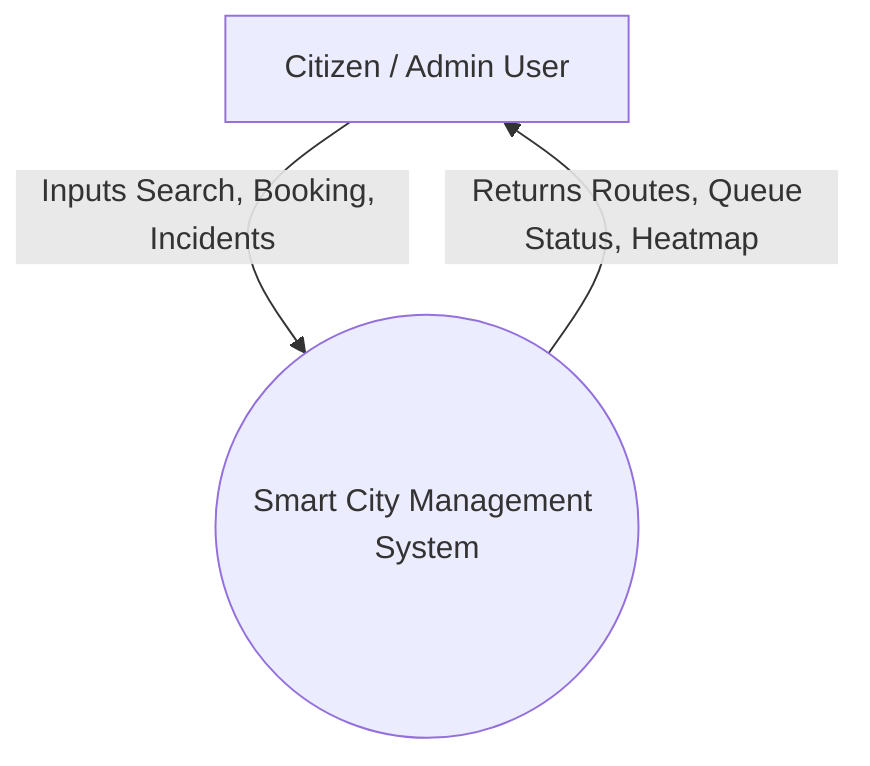
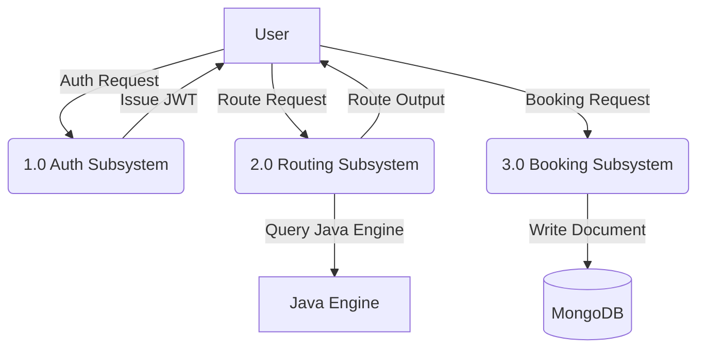
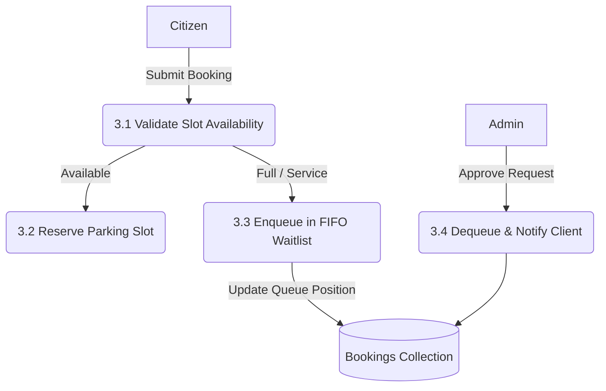

# 📐 System Diagrams Suite - Smart City Management System (SCMS)

This document contains all formal architectural and software engineering diagrams for the **Smart City Management System (SCMS)**, formatted using GitHub-compatible Mermaid diagrams.

---

## 1. System Architecture Diagram



---

## 2. Sequence Diagram (Emergency Priority Route Calculation)



---

## 3. Class Diagram (Core Backend & Algorithm Entities)



---

## 4. Entity-Relationship (ER) Diagram



---

## 5. Use Case Diagram

```mermaid
graph LR
    actor Citizen as Citizen Client
    actor Admin as Admin Operator

    subgraph SCMS System
        UC1(Calculate Route)
        UC2(Book Parking / Join Queue)
        UC3(View Live Traffic Heatmap)
        UC4(Approve / Reject Bookings)
        UC5(Dispatch Emergency Units)
        UC6(Manage Citizens & Departments)
        UC7(Optimize Utility Grid MST)
    end

    Citizen --> UC1
    Citizen --> UC2
    Citizen --> UC3

    Admin --> UC1
    Admin --> UC2
    Admin --> UC3
    Admin --> UC4
    Admin --> UC5
    Admin --> UC6
    Admin --> UC7
```

---

## 6. Deployment Diagram



---

## 7. Data Flow Diagrams (DFD)

### DFD Level 0 (Context Diagram)


### DFD Level 1


### DFD Level 2 (Booking & Queue Process)

