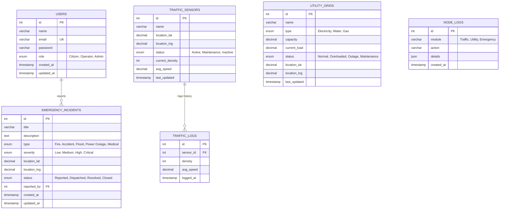

# Entity Relationship (ER) Diagram

Below is the entity-relationship model of the Smart City Management System Database in Mermaid syntax.

### Table Relationships and Cardinalities

1. **Users to Emergency Incidents (`one-to-many`)**: 
   - A registered citizen or operator (`USERS`) can submit zero, one, or multiple emergency reports (`EMERGENCY_INCIDENTS`). 
   - Each report is optionally associated with the reporter user's ID via the `reported_by` foreign key (which is set to null if the user account is deleted).

2. **Traffic Sensors to Traffic Logs (`one-to-many`)**:
   - A sensor (`TRAFFIC_SENSORS`) periodically registers speed and density metrics.
   - The metrics are stored in the historical `TRAFFIC_LOGS` table for analytics, forming a one-to-many relation mapped by `sensor_id`.

3. **Node Logs (`standalone`)**:
   - The `NODE_LOGS` table logs JSON actions taken by operators or the automated algorithm engines (shortest route paths, MST optimizations). It does not maintain strict FK relations to minimize lock contentions, serving as a high-speed write-heavy ledger.
